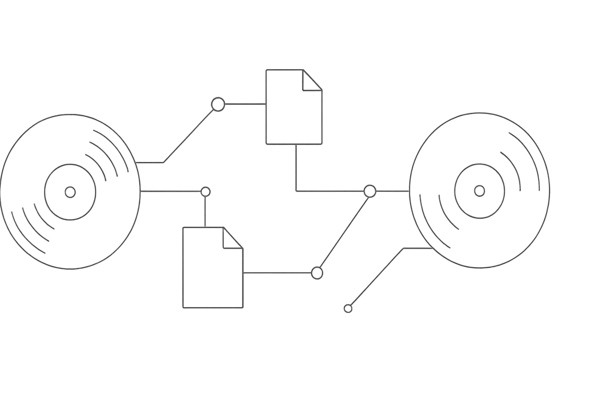

    
    <h1>Discogs API Specs Repo</h1>

> #### Download [the `JSON` version](https://raw.githubusercontent.com/wyattowalsh/discogs-api-spec/refs/heads/main/discogs.json) or [the `YAML` version](https://raw.githubusercontent.com/wyattowalsh/discogs-api-spec/refs/heads/main/discogs.yaml)

---

> [!TIP]
> #### View the spec on [***Swagger***](https://petstore.swagger.io/?url=https://raw.githubusercontent.com/wyattowalsh/discogs-api-spec/main/discogs.json) or [***Redocly***](https://redocly.github.io/redoc/?url=https://raw.githubusercontent.com/wyattowalsh/discogs-api-spec/main/discogs.json)

---

> [!CAUTION]
> [ChatGPT](https://chatgpt.com/share/68885aae-1ac4-800e-8880-9d6e3939c138) was used to generate a prompt to transform [*the discogs dev docs*](./discogs-api-dev-docs.md) into `JSON` and `YAML` [OpenAPI specs (per v3.1.1)](./OpenAPI-Specification-version-3.1.1.md). The resulting prompt was then used with [Google Gemini](https://g.co/gemini/share/894bf85491db), to carry out the original transformation/compilation of the [`discogs.json`](./discogs.json) and [`discogs.yaml`](./discogs.yaml) specs in full.